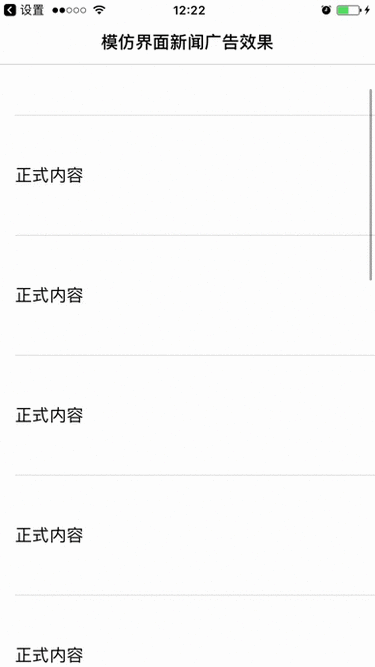

# AdvertisementDemo  for iOS 

### Table of Contents
- [Introduction](#introduction)
- [Installing AdvertisementDemo](#installing-AdvertisementDemo)
- [iOS Sample App](#ObjectivC-Examples)

## Introduction

AdvertisementDemo 是一个模仿界面新闻广告实现效果的一个Demo, 提供了一种实现的思路，相关的要点会在以下列出。

界面新闻广告的效果:广告从底部出现到上升的移动过程中可以看到一张广告的全图，从广告内容开始要移出屏幕到全部移除屏幕的过程中固定展示广告的重点视图

这里展示了界面新闻的广告效果和本Demo实现的效果的对比

<!---->


## Installing-AdvertisementDemo

### Github Repo

下载代码 [AdvertisementDemo Github Repo](https://github.com/yuhengZhu/AdvertisementDemo/).

## ObjectivC-Examples

以下介绍实现的要点:

设置tableView的backgroundView为广告图片

```objective-c
// 背景视图(广告全图)
UIImage *image = [UIImage imageNamed:@"backgroundImage3"];
UIImageView *bgView = [[UIImageView alloc] initWithImage:image];
bgView.frame = tableView.bounds;
```

裁剪广告部分(将广告全图中的部分视图作为Cell中显示的广告视图)

```objective-c
CGSize s = CGSizeMake(bgView.frame.size.width, advCellH);
UIGraphicsBeginImageContextWithOptions(s, NO, 1.0);
[bgView.layer renderInContext:UIGraphicsGetCurrentContext()];
UIImage *cropImage = UIGraphicsGetImageFromCurrentImageContext();
UIGraphicsEndImageContext();
```

设置广告固定显示的Cell

```objective-c
AdvertiseCell *cell = [AdvertiseCell cellWithTableView:tableView];
// 设置广告的图片
[cell setImage:self.cropImage];
return cell;
```

监听tableView的滚动事件,判断广告是否将要移除屏幕;将要移除屏幕的时候设置广告cell的内容为裁剪图片的内容,否则设置广告图片隐藏, 显示底部视图

```objective-c
- (void)scrollViewDidScroll:(UIScrollView *)scrollView {

    // 获取广告的位置,坐标转化(根据实际业务场景获取位置,这里使用了偷懒的办法)
    NSIndexPath *indexPath = [NSIndexPath indexPathForRow:6 inSection:0];

    CGRect rectInTableView = [_tableView rectForRowAtIndexPath: indexPath];

    CGRect rectInSuperview = [_tableView convertRect:rectInTableView toView:[_tableView superview]];

    AdvertiseCell *cell = [self.tableView cellForRowAtIndexPath:indexPath];

    if (rectInSuperview.origin.y < self.tableView.frame.origin.y) {

        [cell setImageHide:NO];
    } else {
    
        [cell setImageHide:YES];
    }
}
```

设置广告Cell的时候需要将背景颜色设置为透明,用于滑动的时候宣誓tableView的背景视图(广告全图), 在需要的时候再显示广告的固定视图

```objective-c

cell.backgroundColor = [UIColor clearColor];

- (void)setImageHide:(BOOL)hide {

    if (hide) {

    self.backgroundColor = [UIColor clearColor];

    } else {

    self.backgroundColor = [UIColor whiteColor];
    }

    self.customImageView.hidden = hide;
}

```
